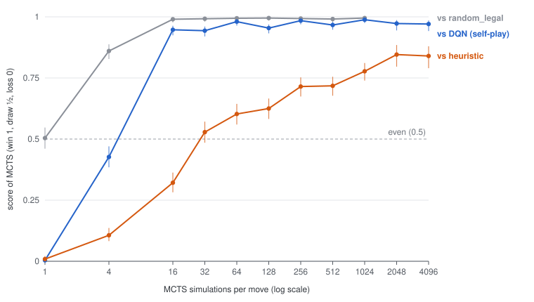

# slinky

A fast [Battlesnake](https://play.battlesnake.com) environment in JAX that
matches the official rules exactly, for benchmarking reinforcement learning
algorithms.

- **Exact rules.** Turn resolution is checked against the
  [official rules engine](https://github.com/BattlesnakeOfficial/rules) on
  tens of thousands of transitions. This includes every elimination cause,
  head-to-heads between 3 or more snakes, the tail rule and stacked hazards.
- **Pure functions.** `reset` and `step` are pure, so you can `jit` them,
  `vmap` them over thousands of games and `scan` them over turns, on CPU,
  GPU or TPU.
- **Multi-agent.** All snakes move at once; every agent gets its own
  observation, reward and action mask.
- **Extensible.** Rulesets (standard, solo, wrapped, constrictor) and maps
  (start positions, food, hazards) are separate pieces, as in the official
  engine.

## Quickstart

```bash
uv venv && uv pip install -e . --group dev   # or: pip install -e ".[rl]"
```

```python
import jax
from slinky.env import BattlesnakeEnv
from slinky.types import GameConfig
from slinky.policies import random_legal_policy
from slinky.render import render

env = BattlesnakeEnv(GameConfig())                # 11x11 1v1 ("duel"), standard rules
key = jax.random.key(0)
state, ts = env.reset(key)
print(ts.obs.shape)                               # (2, 21, 21, 13): egocentric, per agent

step = jax.jit(env.step)
while not state.done:
    key, k_act, k_step = jax.random.split(key, 3)
    actions = random_legal_policy(k_act, state, env)  # int32[2]
    state, ts = step(k_step, state, actions)
print(render(state))
```

To run many games in parallel, `vmap` everything:

```python
batch_reset = jax.jit(jax.vmap(env.reset))
batch_step = jax.jit(jax.vmap(env.step_autoreset))   # finished games restart automatically
states, ts = batch_reset(jax.random.split(key, 4096))
```

## The API

| | |
|---|---|
| `GameConfig` | Static settings: `width`, `height`, `num_snakes`, `ruleset` (`standard`, `solo`, `wrapped`, `constrictor`, `wrapped_constrictor`), `map` (`standard`, `empty`), `food_spawn_chance`, `minimum_food`, `hazard_damage_per_turn`, `max_turns`. Defaults are the official 1v1 setup. |
| `env.reset(key)` | Returns `(State, TimeStep)` at turn 0, with snakes placed and starting food. |
| `env.step(key, state, actions)` | `actions` is `int[N]`: `0=up, 1=down, 2=left, 3=right`. Any other value is an invalid move, and the snake repeats its last move, as in the engine. |
| `env.step_autoreset(...)` | Same as `step`, but a finished game is replaced by a new one. `ts.final_obs` keeps the observation of the state the game ended in, for bootstrapping values on truncation. |
| `TimeStep` | `obs[N, ...]`, `reward[N]`, `done`, `truncated`, `alive[N]`, `action_mask[N, 4]` (and `final_obs` from `step_autoreset`). |

- **Rewards** (default `win_loss_reward`):
  - −1 on the turn a snake is eliminated;
  - +1 to the last snake standing;
  - 0 for snakes that die on the final turn when nobody survives (a draw).
  - In solo games, dying is simply −1.
  - Pass `reward_fn=` to use your own.
- **Observations** (`slinky.observations`):
  - **Egocentric** (the default): the board is centred on the agent's head
    and padded, giving `[2H-1, 2W-1, 13]`. Wrapped boards are rolled
    instead, giving `[H, W, 13]`.
  - **Allocentric:** `[H, W, 13]`.
  - The 13 channels are: board mask, food, hazards, own head, own body, own
    body countdown, opponent heads (split into longer-or-equal and shorter),
    opponent bodies, opponent body countdown, opponent health, own health and
    own length.
  - Pass `obs=` a function to use your own, or `None` to skip observations.
- **Action mask:** masks out a move only if it certainly hits a wall or a
  body next turn, whatever the other snakes do.
  - It applies the tail rule exactly: a tail square is open unless that tail
    is stacked.
  - It ignores the bodies of snakes that are certain to starve first.
  - It does not consider hazards, your own starvation or head-to-heads.
  - **Rows are never all False.** Dead snakes, and snakes with no move that
    can survive, get all-True rows, so masked softmaxes never produce NaNs.

## Evaluating policies

`slinky.evaluate.play_match` plays two policies against each other over
thousands of games at once and reports wins, draws and losses from the
first policy's point of view, with a 95% confidence interval on the score
(win = 1, draw = ½). Seats are rotated across games, so neither policy gets
the better starting seat more often.

```python
from slinky.evaluate import greedy_from_q, play_match, random_legal

result = play_match(env, greedy_from_q(q_fn), random_legal(env), key, num_games=1000)
print(result.wins, result.draws, result.losses, result.score, "+/-", result.score_ci95)
```

A policy is a function `(key, state, timestep) -> int32[N]` for one game.
`random_legal(env)` is the reference opponent: it picks uniformly among the
moves that don't certainly die next turn.

`batch_size` is the number of game slots simulated at once: when a game
ends, its slot starts the next one, so no slot waits for the longest game
(game lengths are heavy-tailed; this made MCTS evaluations 3-3.5x faster).
Game `g` depends only on `(key, g)`, so the result is the same for every
`batch_size`. `run_match` also reports the loop iterations and slot
utilisation, plays a range of game ids (`first_game`) and takes a progress
callback.

`benchmarks/strength.py` plays all pairs of two agent lists and keeps the
results in a resumable JSONL file (`--table` prints markdown tables);
`--workers 4` runs four matchups at once, each in a process pinned to its
own core, which is the fast path on a 4-core machine.

## Baselines

Reference opponents for the 1v1 duel, from weakest to strongest. Full results
and the MCTS sweep are in [`benchmarks/README.md`](benchmarks/README.md).

- **`random_legal`** (`slinky.evaluate`): uniformly random among the moves
  that don't certainly die next turn.
- **DQN** (`baselines/dqn.py`, see [`baselines/README.md`](baselines/README.md)):
  self-play Double DQN with one shared network playing both snakes. After 31
  minutes of training on a 4-core CPU, it scores 0.993 ± 0.002 against
  `random_legal` (99.2% wins over 5,000 games). It plays between MCTS with 4
  and with 16 simulations.
- **PPO** (`baselines/ppo.py`, see [`baselines/README.md`](baselines/README.md)):
  self-play PPO with one shared actor-critic network and masked illegal moves.
  After 67 minutes of training on 3 CPU cores, it beats the DQN 0.868 and
  `random_legal` 0.998, and scores 0.296 against the heuristic. It plays
  between MCTS with 4 and with 16 simulations, closer to 16.
- **Rainbow DQN** (`baselines/rainbow.py`, see
  [`baselines/README.md`](baselines/README.md#rainbow-dqn-rainbowpy)): all six
  Rainbow extensions on the same self-play setup, with a distributional head
  on the game's exact return range [−1, 1]. At the DQN's budget it ties the
  DQN head to head (0.504 ± 0.031). It scores 0.983 against `random_legal` and
  0.084 against the heuristic, against the DQN's 0.992 and 0.047.
- **Heuristic** (`slinky.heuristic`): a hand-written snake.
  - It uses time-aware flood fills, Voronoi territory and food control.
  - It picks moves with a one-ply simultaneous-move search over the exact
    rules, after safety tiers.
  - It scores 0.988 against `random_legal` and 0.947 against the DQN, at about
    0.05 ms per move.
  - It plays like MCTS with about 32 simulations.
- **MCTS** (`slinky.mcts`): simultaneous-move MCTS (decoupled UCT, with the
  heuristic's evaluation at the leaves).
  - Against the heuristic it scores 0.53 at 32 simulations, 0.78 at 1024 and
    0.85 at 2048. It levels off there, held back by opening head-on draws.
  - At Battlesnake's 500 ms per move (24,000 simulations: one game's move on
    one core, at p90) it scores 0.875 against the heuristic and 0.949 against PPO.
  - It costs about 3.5–6 µs per simulation per CPU core in batches (up to
    4096 simulations), and about 18 µs for one game alone.



## Watching games

`slinky.replay` records games between named agents and writes a
self-contained HTML viewer (no server; open the file in a browser):

```bash
python -m slinky.replay --a heuristic --b dqn --games 8 --html replays/heuristic-vs-dqn.html
python -m slinky.replay --a mcts-256 --b heuristic --games 4 --out replays/mcts.json   # JSON only
python -m slinky.replay --agents heuristic,random_legal,mcts-64,dqn --games 2 --html replays/four.html   # 4 snakes
```

- **Agents** come from the registry in `slinky.agents` (shared with
  `benchmarks/strength.py`): `random_legal`, `random`, `heuristic`, `dqn`
  (the checkpoint in `baselines/checkpoints/`) or `dqn:<run dir>`, `ppo`
  (greedy), `ppo-sample` or `ppo:<run dir>`, `rainbow` or `rainbow:<run dir>`,
  and `mcts-<simulations>` with dash shorthands and/or `:field=value`
  overrides of `MCTSConfig`, e.g. `mcts-256-rm`, `mcts-64-rollout` or
  `mcts-128:exploration=0.5`. Names are shown in a canonical form that lists
  only non-default settings.
- **The viewer** shows the board (API coordinates, `(0, 0)` bottom-left),
  each snake's length and health, eliminations with the engine's cause, a
  health-by-turn strip that doubles as the scrubber, the match score and the
  game list. Keys: Space play/pause, ←/→ step, Home/End, `[`/`]` previous or
  next game. Another replay JSON can be opened from the page or dropped on it.
- **The format** (`slinky-replay/1`) is documented in `src/slinky/replay.py`:
  one frame per turn with head-first bodies, health, food and hazards, about
  250 bytes per turn in a duel. `replay.game_from_states` turns a sequence of
  states from your own loop into a game record.

## How it works

Each snake is stored as a **countdown grid**. For snake `i`,
`state.body[i, y, x]` is the number of turns until cell `(x, y)` is vacated.
The head cell holds the snake's length, the tail holds 1, and a stacked tail
(the snake just ate) holds 2.

- **Moving:** subtract 1 from every cell, then write the length at the new
  head.
- **Eating:** add 1 to every cell. This reproduces the engine's duplicated
  tail segment exactly.
- **Collisions:** a lookup in the grid of each snake after it has moved.

So every step is a fixed number of dense array operations, with no
variable-length lists or per-segment loops. Turn resolution follows the
engine's stage order; see
[`docs/battlesnake/ENGINE_RULES.md`](docs/battlesnake/ENGINE_RULES.md).

## Rules fidelity and tests

```bash
.venv/bin/python -m pytest            # ~2-4 minutes; the oracle tests need Go >= 1.22
```

`tools/oracle` is a small Go program that links the official rules engine.
It is only used for testing; see its README. The tests use it in three ways:

- **Engine-generated games**
  (`tests/test_parity.py::test_transitions_match_engine`).
  - Thousands of games are played by the engine: 1v1, 4-, 8- and 12-player
    games, 7×7 to 19×19 boards, wrapped, constrictor, solo, the royale map,
    and the hazard-pits, sinkholes and snail-mode maps.
  - Every transition must be reproduced exactly: bodies, health, elimination
    causes and turns, food and hazards.
- **Our own games checked by the engine**
  (`test_our_rollouts_match_engine`): states from our rollouts are sent to
  the engine, which must agree with our next state.
- **Spawning and setup:** engine food spawns must land on cells our spawn
  mask allows, at the engine's rate. Starting positions and starting food
  must follow the engine's rules, in both directions: engine states fit our
  rules, and our states are ones the engine could produce.

Two more test files check the rules directly:

- `tests/test_rules.py` has hand-written edge cases with explicit expected
  outcomes, each confirmed against the engine.
- `tests/test_fuzz_rules.py` fuzzes the rules against the engine with random
  states that games rarely reach: tightly coiled and fully stacked bodies,
  3- and 4-way head-ons with food on the square, stacked hazards with zero,
  negative or very large damage, 1-wide and non-square boards, up to 16
  snakes, and invalid moves.

An independent review ran more than 300k fuzzed and rollout transitions
through the engine and found no differences in the rules.

Food positions are random, so games can't be replayed turn for turn. The
random choices (start positions, food) follow the engine's *distributions*,
not Go's random-number stream.

## Performance

Run `python benchmarks/throughput.py` to measure steps per second (a step is
one game advancing one turn) with a random policy that avoids certain death.

Measured on a 4-core cloud CPU (no GPU) with jax 0.11.2, using a random
policy that avoids certain death and `step_autoreset`. A step is one game
advancing one turn, so multiply by the number of snakes for per-agent steps.

| config | batch | steps/s, no obs | steps/s, egocentric obs |
|---|--:|--:|--:|
| 11×11 duel | 1 | 32k | 18k |
| 11×11 duel | 1,024 | 381k | 99k |
| 11×11 duel | 8,192 | 627k | 69k |
| 11×11, 4 snakes | 8,192 | 420k | 29k |
| 19×19, 4 snakes | 8,192 | 212k | 10k |

Without observations the simulation is cheap: about 2–5 µs per game-step
on CPU. Building float32 observation tensors (a `[21, 21, 13]` image per
agent in a duel) then dominates, which is memory-bound on CPU. Accelerators
should scale much better with batch size.

## Roadmap

1. **Core** (done): standard, duel, solo, wrapped and constrictor rules;
   standard and empty maps; observations; engine parity tests; benchmark.
2. **More modes:**
   - royale, hazard maps and healing pools;
   - official API JSON (`/move` request) conversion, so a trained policy can
     play on the real Battlesnake servers.
3. **Baselines:**
   - self-play DQN and Rainbow DQN, with a live training dashboard (done; see
     `baselines/`);
   - heuristic snake and simultaneous-move MCTS, with a strength-vs-simulations
     benchmark (done; see `benchmarks/README.md`);
   - self-play PPO (done; see `baselines/`);
   - population or league training;
   - AlphaZero-style search with a learned value and policy, on top of
     `slinky.mcts`.

## Layout

```
src/slinky/       types, rules (turn pipeline), maps, env, observations, render,
                  engine_json, policies, evaluate (matches between policies),
                  heuristic (hand-written snake), mcts (simultaneous-move MCTS),
                  agents (named-agent registry), replay (+ viewer.html)
baselines/        RL baselines (self-play DQN, PPO and Rainbow DQN), their checkpoints
                  and a live training dashboard (dashboard.py)
tests/            unit, edge-case and engine-parity tests
tools/oracle/     Go test oracle around the official rules engine (test-only)
benchmarks/       throughput and strength benchmarks, results/ (strength sweep data)
docs/research/    literature notes: simultaneous-move MCTS, Battlesnake heuristics
docs/battlesnake/ official rules/API docs (MIT) + ENGINE_RULES.md
legacy/           the original C++ prototype
```
